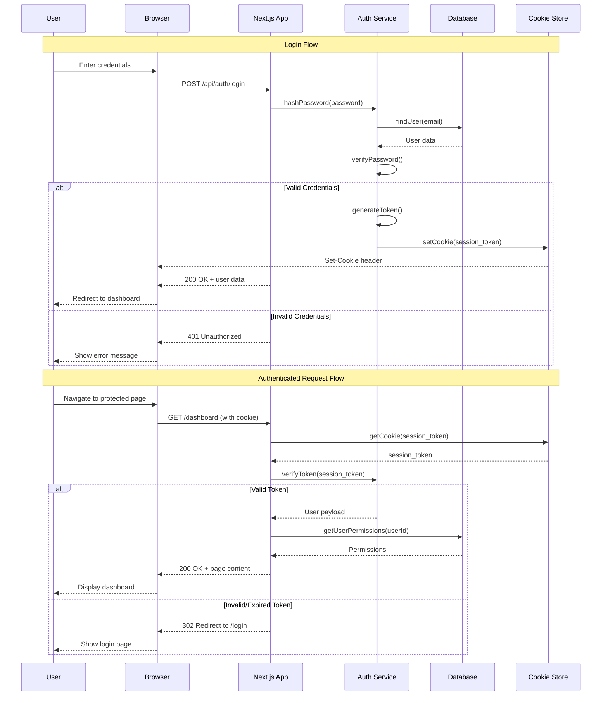
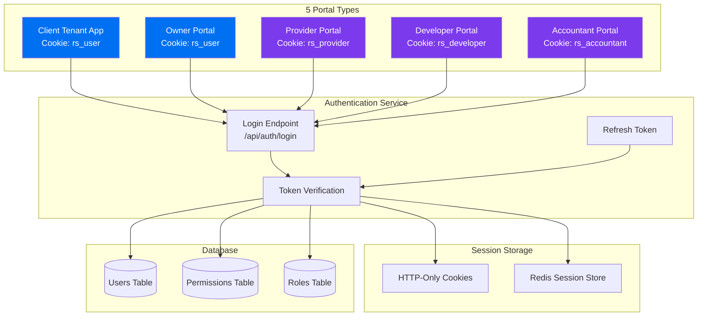
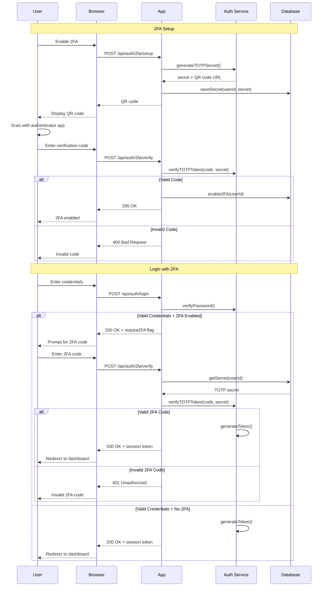
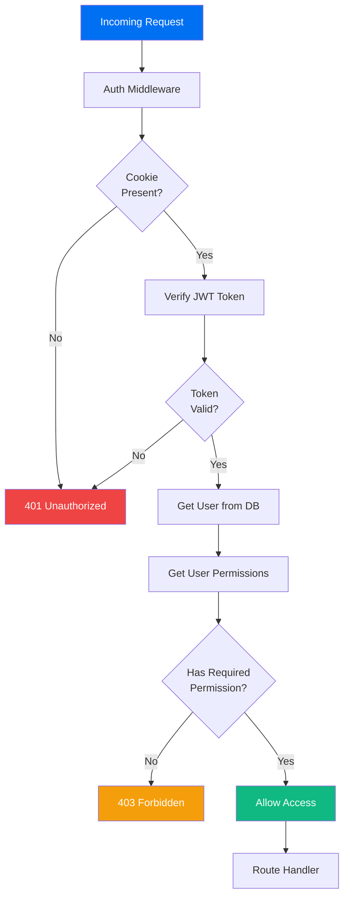

# Authentication Flow Diagram

## Multi-Portal Authentication Architecture



## Portal-Specific Authentication



## 2FA Flow (TOTP)



## RBAC Permission Check



## Cookie Configuration

### Provider Portal
```typescript
{
  name: 'rs_provider',
  httpOnly: true,
  secure: true,
  sameSite: 'lax',
  maxAge: 3600 // 1 hour
}
```

### Tenant App
```typescript
{
  name: 'rs_user',
  httpOnly: true,
  secure: true,
  sameSite: 'lax',
  maxAge: 3600 // 1 hour
}
```

### Developer Portal
```typescript
{
  name: 'rs_developer',
  httpOnly: true,
  secure: true,
  sameSite: 'lax',
  maxAge: 3600 // 1 hour
}
```

## Security Features

1. **HTTP-Only Cookies**: Prevent XSS attacks
2. **Secure Flag**: HTTPS only in production
3. **SameSite**: CSRF protection
4. **Token Expiration**: 1-hour sessions
5. **Refresh Tokens**: 7-day validity
6. **Password Hashing**: bcrypt with salt
7. **TOTP 2FA**: Time-based one-time passwords
8. **Rate Limiting**: Prevent brute force attacks
9. **Audit Logging**: Track all authentication events
10. **RBAC**: Role-based access control with 30+ permissions

