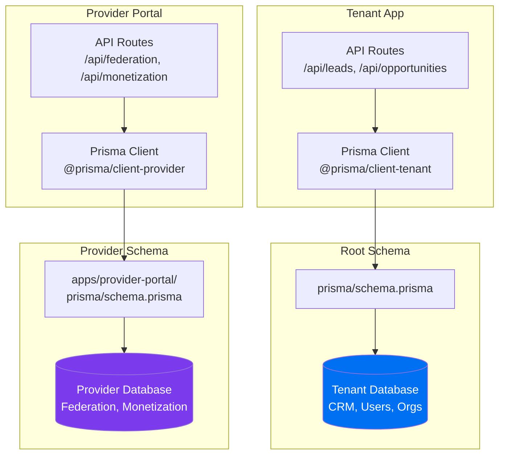
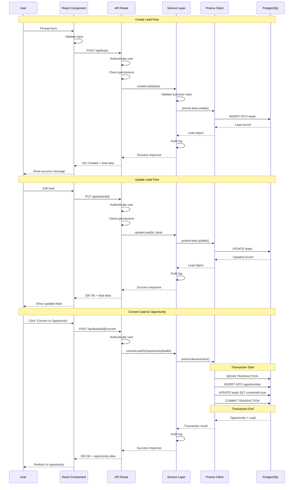
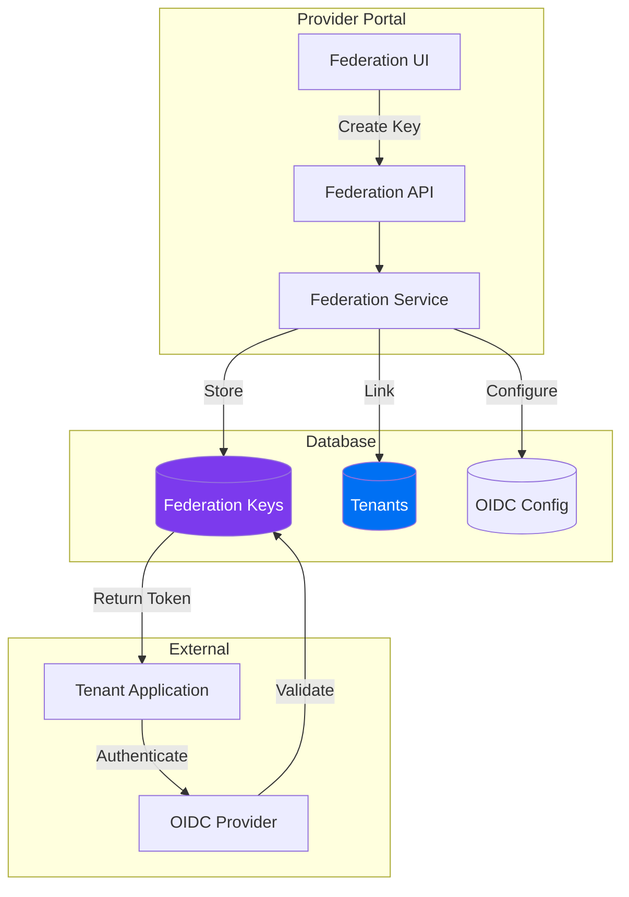
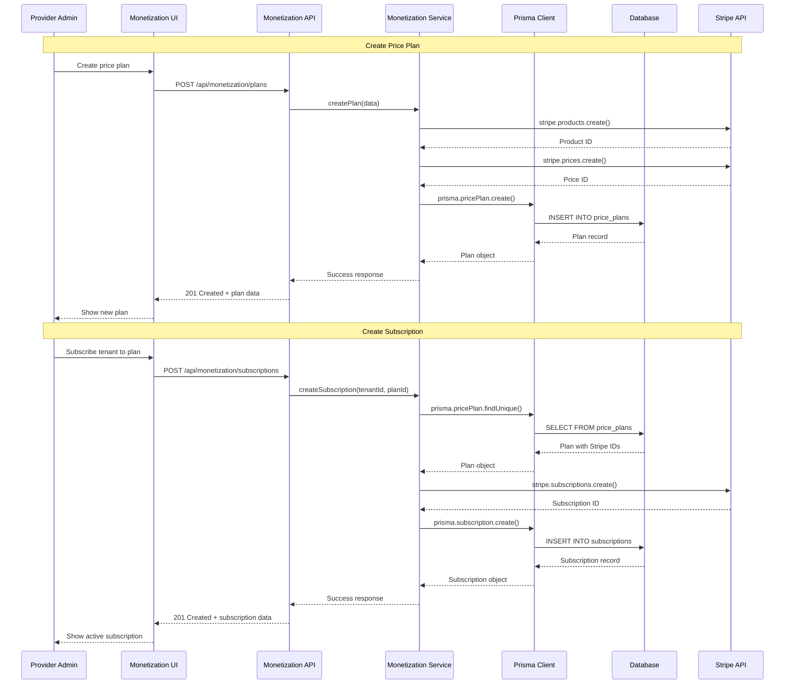
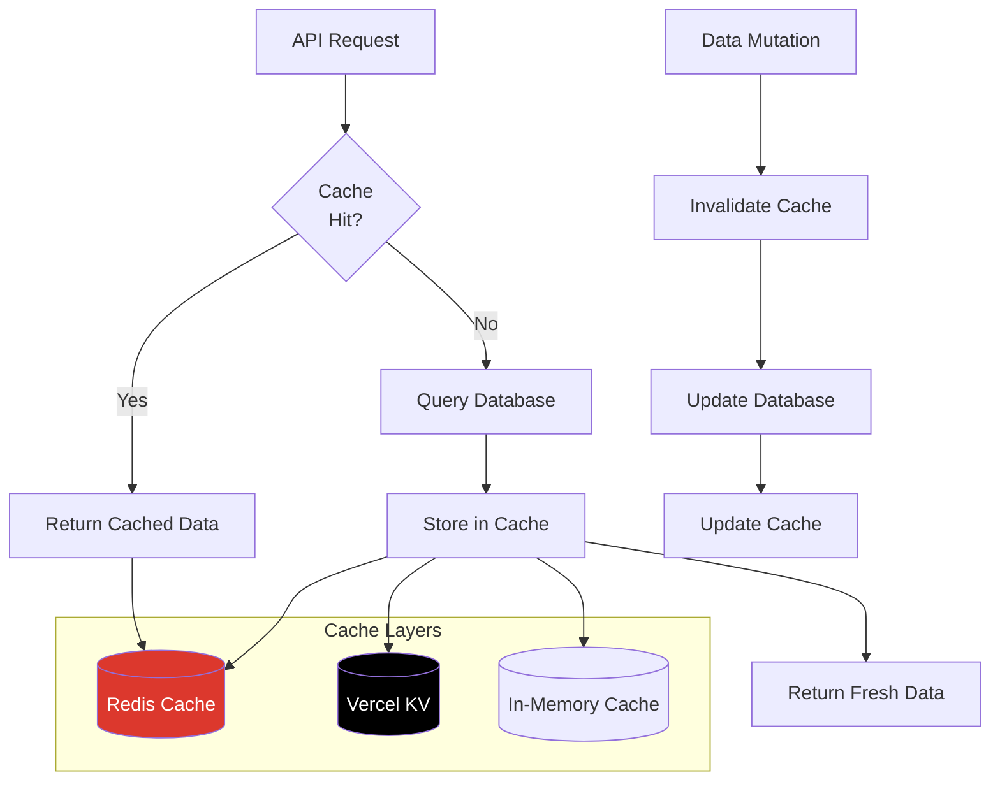
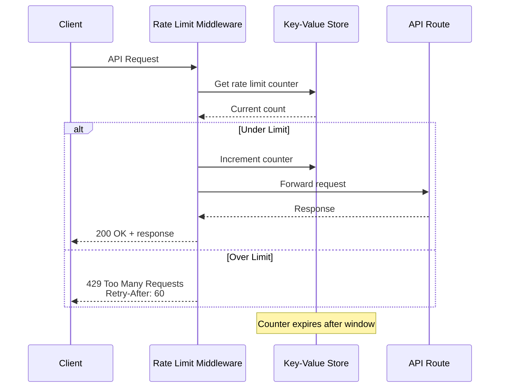
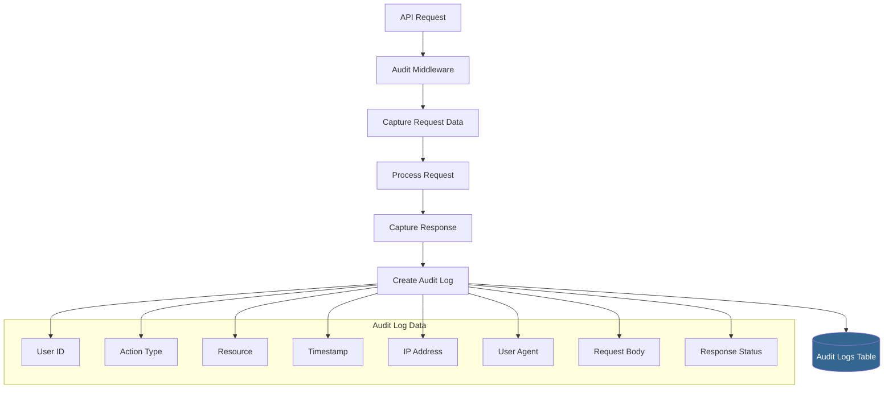
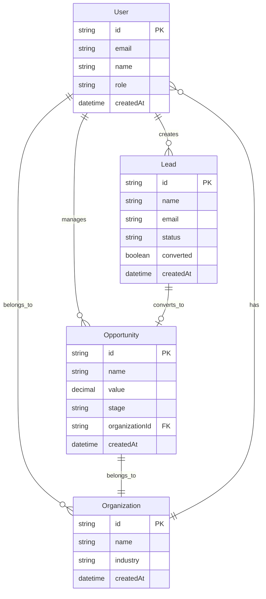
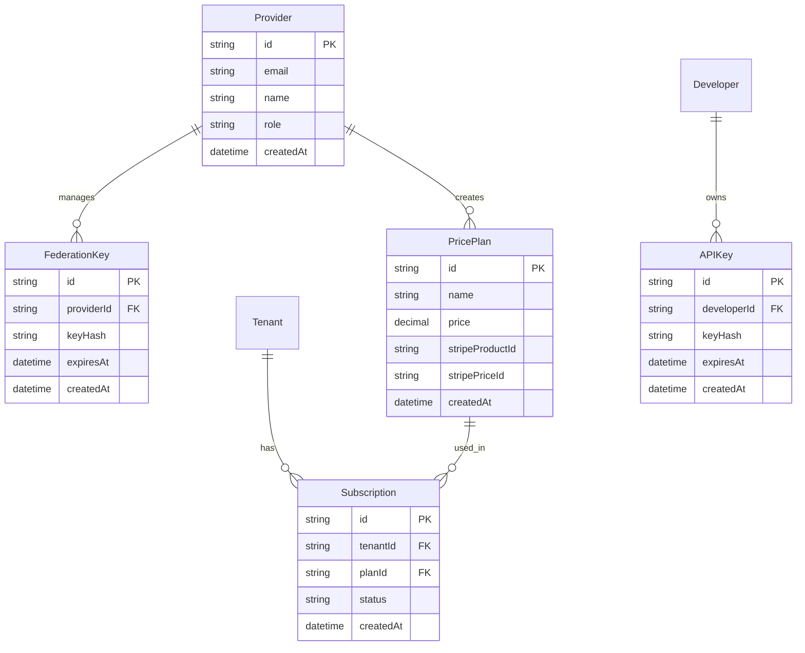

# Data Flow Diagram

## Dual Prisma Schema Architecture

## CRM Data Flow

## Federation Data Flow

## Monetization Data Flow

## Caching Strategy

## Rate Limiting Data Flow

## Audit Logging Data Flow

## Data Relationships

### Tenant App Schema

### Provider Portal Schema

