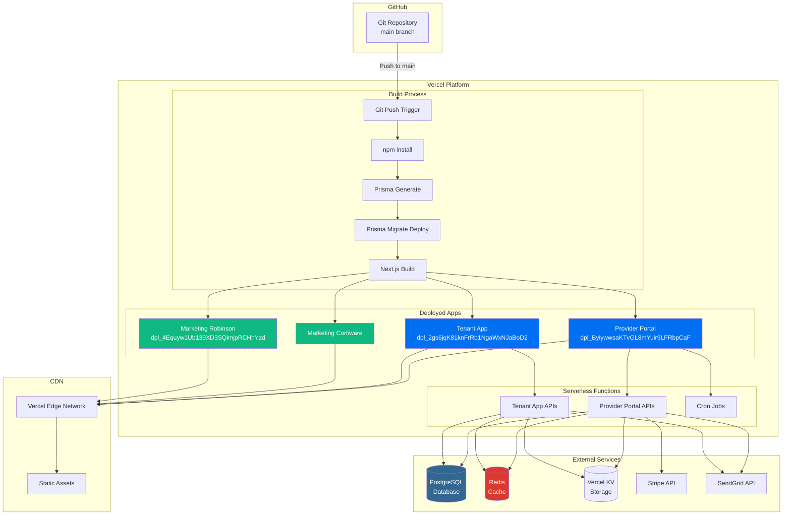
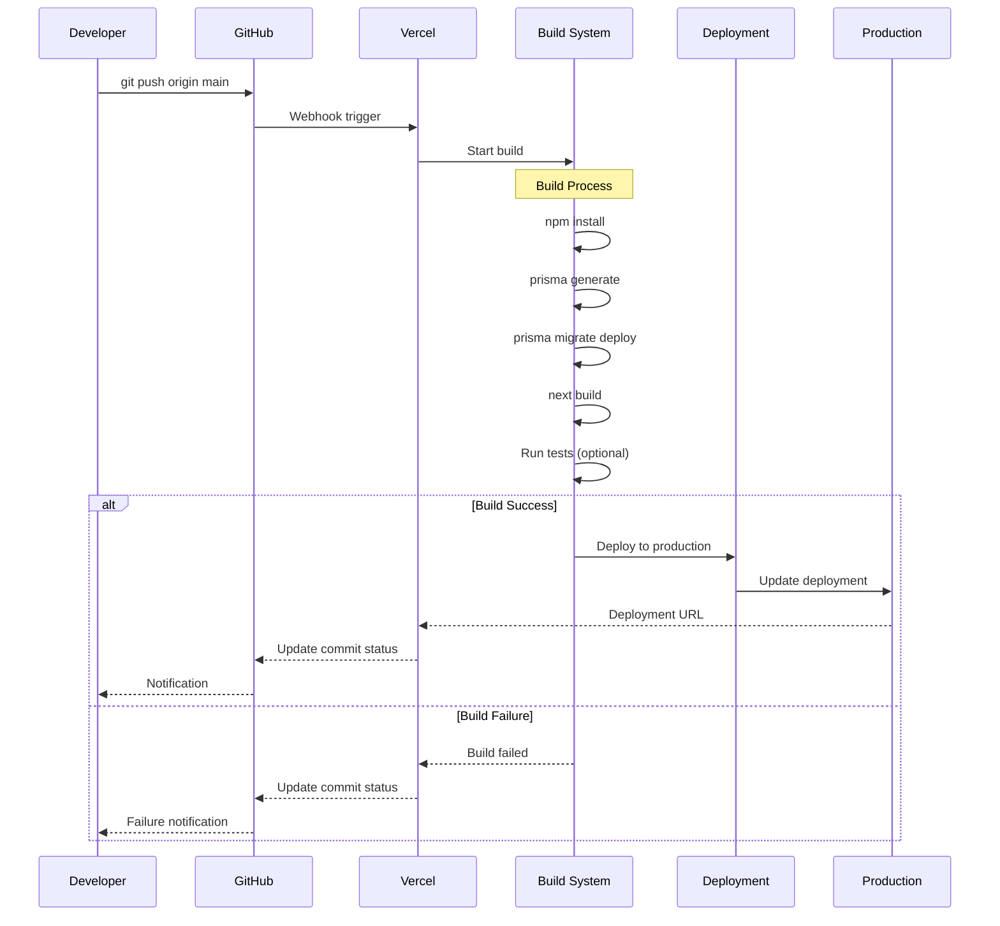
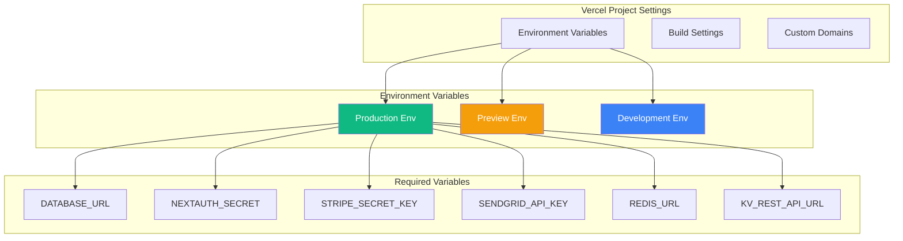
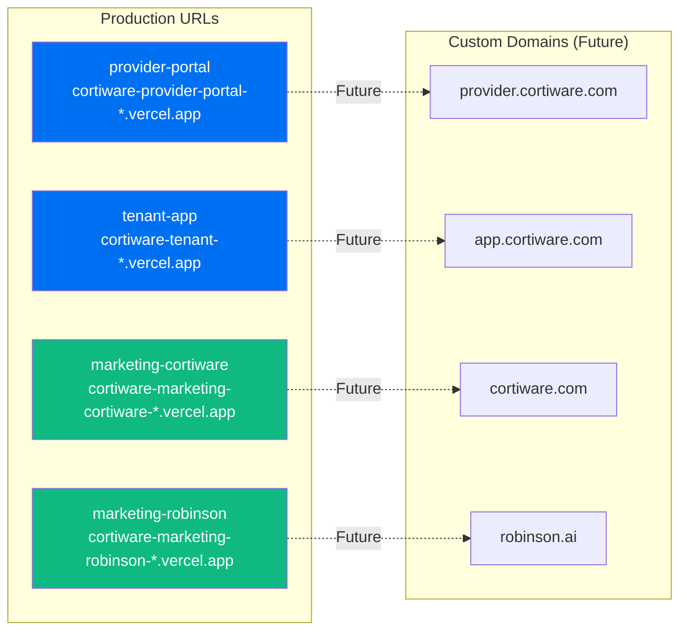
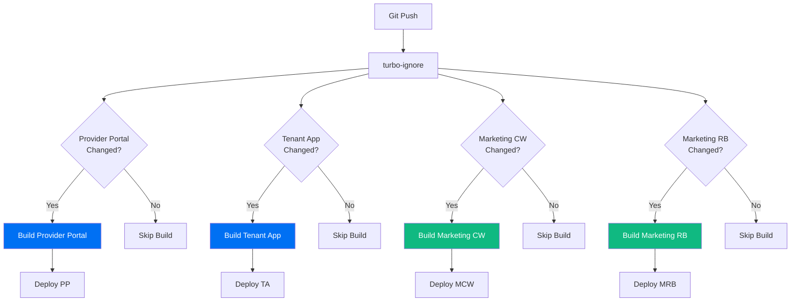
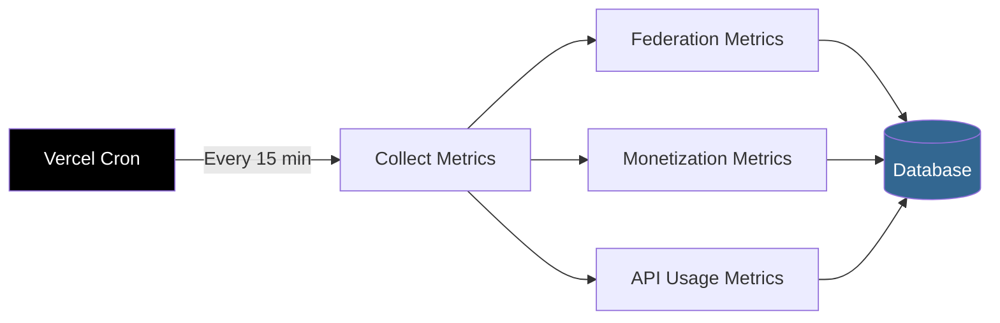
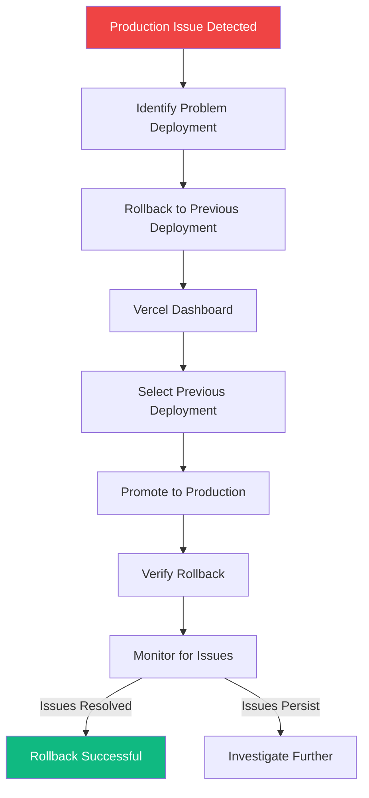
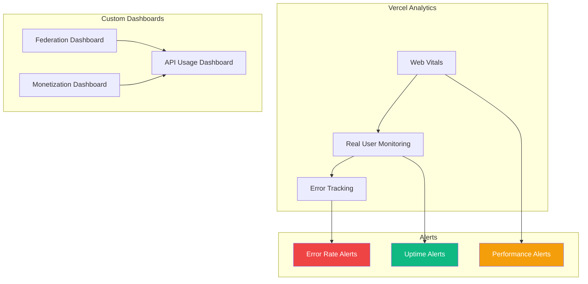

# Deployment Architecture Diagram

## Vercel Deployment Architecture



## Build Pipeline



## Environment Configuration



## Deployment URLs

### Production Deployments



## Monorepo Build Strategy



## Serverless Functions

```mermaid
graph TB
    subgraph "Provider Portal Functions"
        FedAPI[/api/federation/*]
        MonAPI[/api/monetization/*]
        DevAPI[/api/developer/*]
        ObsAPI[/api/observability/*]
        CronAPI[/api/cron/collect-metrics]
    end
    
    subgraph "Tenant App Functions"
        LeadsAPI[/api/leads/*]
        OppsAPI[/api/opportunities/*]
        OrgsAPI[/api/organizations/*]
        AuthAPI[/api/auth/*]
    end
    
    subgraph "Vercel Edge Network"
        EdgeFunc[Edge Functions]
        Middleware[Middleware]
    end
    
    FedAPI --> EdgeFunc
    MonAPI --> EdgeFunc
    LeadsAPI --> EdgeFunc
    OppsAPI --> EdgeFunc
    
    EdgeFunc --> Middleware
    Middleware -->|Rate Limit| RateLimit[Rate Limiting]
    Middleware -->|Auth| AuthCheck[Authentication]
    Middleware -->|Audit| AuditLog[Audit Logging]
    
    style EdgeFunc fill:#000,color:#fff
```

## Cron Jobs



## Deployment Checklist

### Pre-Deployment
- [ ] All tests passing (`npm run test`)
- [ ] TypeCheck passing (`npm run typecheck`)
- [ ] Lint passing (`npm run lint`)
- [ ] No uncommitted changes
- [ ] Environment variables set in Vercel
- [ ] DATABASE_URL configured for production

### Post-Deployment
- [ ] Check deployment status in Vercel dashboard
- [ ] Review build logs for errors or warnings
- [ ] Verify deployment URLs load correctly
- [ ] Check Vercel function logs for runtime errors
- [ ] Confirm Prisma migrations ran successfully
- [ ] Test critical user flows
- [ ] Monitor error rates in Vercel Analytics

## Rollback Strategy



## Monitoring & Observability



